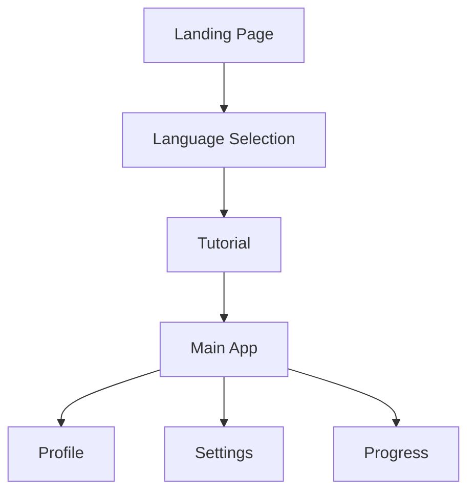

# FableTongue User Experience Flow

## Initial User Journey

### 1. Landing Page
- URL: `/`
- Purpose: Welcome users and initiate the tutorial
- Components:
  - Welcome message
  - "Start Learning" button
  - Language selection interface
  - Tutorial introduction

### 2. Language Selection
- URL: `/select-language`
- Purpose: Choose target language
- Components:
  - List of available languages
  - Language difficulty indicators
  - "Continue" button
  - Back button

### 3. Tutorial Flow
- URL: `/tutorial`
- Purpose: Guide users through app features
- Steps:
  1. Welcome to FableTongue
  2. How stories work
  3. Interactive elements
  4. Progress tracking
  5. Practice exercises
- Components:
  - Progress indicator
  - Step-by-step instructions
  - Interactive examples
  - Next/Previous navigation

### 4. Main App Experience
- URL: `/story`
- Purpose: Core learning experience
- Components:
  - Story display
  - Interactive elements
  - Progress tracking
  - Navigation controls

## Navigation Flow

## Component Connections

### Required Components
1. `LanguageSelector`
   - Location: `src/components/LanguageSelector.tsx`
   - Dependencies: `languageStore.ts`
   - State: Selected language

2. `Tutorial`
   - Location: `src/components/Tutorial.tsx`
   - Dependencies: `tutorialStore.ts`
   - State: Tutorial progress

3. `Story`
   - Location: `src/components/Story.tsx`
   - Dependencies: `storyStore.ts`
   - State: Current story, progress

### State Management
1. `languageStore.ts`
   - Selected language
   - Language preferences
   - Difficulty level

2. `tutorialStore.ts`
   - Tutorial progress
   - Completed steps
   - User preferences

3. `storyStore.ts`
   - Current story
   - Progress tracking
   - User interactions

## Implementation Checklist

### Phase 1: Initial Setup
- [ ] Create landing page with language selection
- [ ] Implement language store
- [ ] Set up tutorial component structure
- [ ] Create basic navigation flow

### Phase 2: Tutorial Implementation
- [ ] Build tutorial steps
- [ ] Implement progress tracking
- [ ] Add interactive examples
- [ ] Create tutorial store

### Phase 3: Main App Integration
- [ ] Connect tutorial completion to main app
- [ ] Implement story generation
- [ ] Add progress tracking
- [ ] Set up user profile

### Phase 4: Polish
- [ ] Add transitions between sections
- [ ] Implement loading states
- [ ] Add error handling
- [ ] Optimize performance

## Testing Requirements

### Unit Tests
- Language selection
- Tutorial navigation
- Story generation
- Progress tracking

### Integration Tests
- Complete user flow
- State management
- Navigation
- Data persistence

### E2E Tests
- Full user journey
- Error scenarios
- Edge cases
- Performance

## Future Considerations
1. Offline support
2. Multi-language support
3. Social features
4. Achievement system
5. Analytics integration 